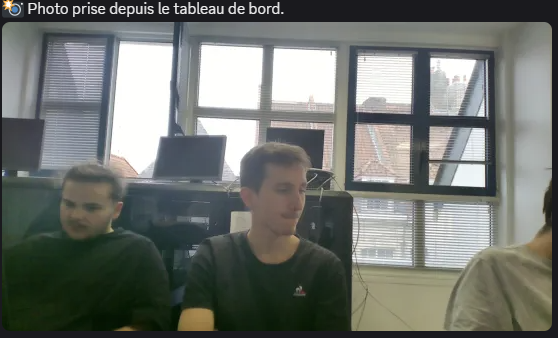
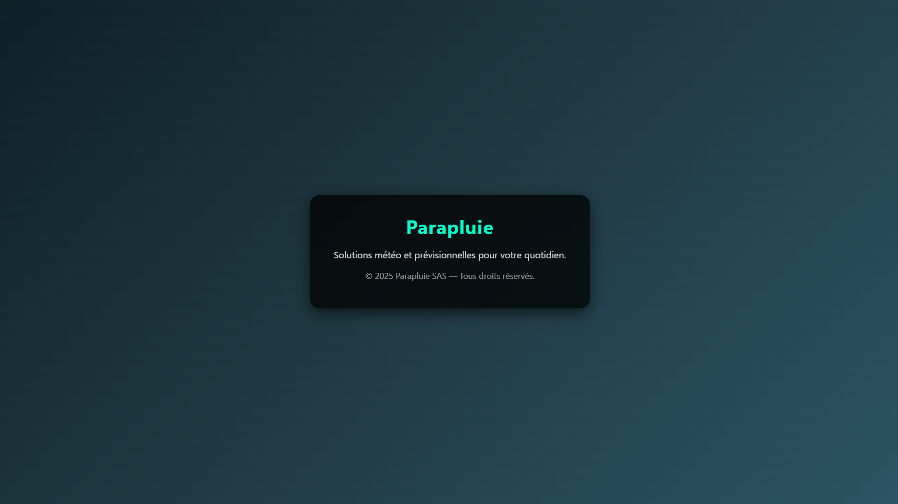
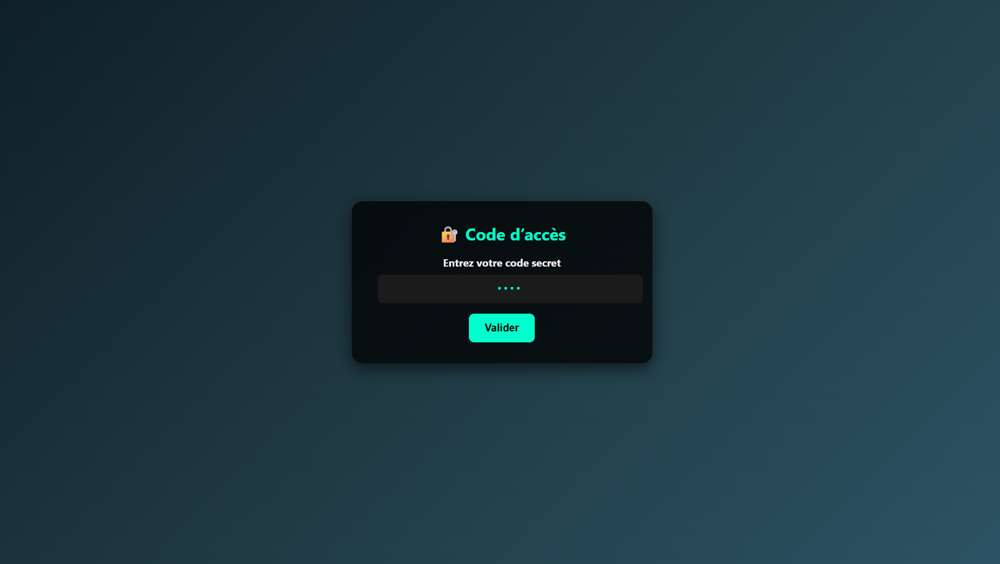
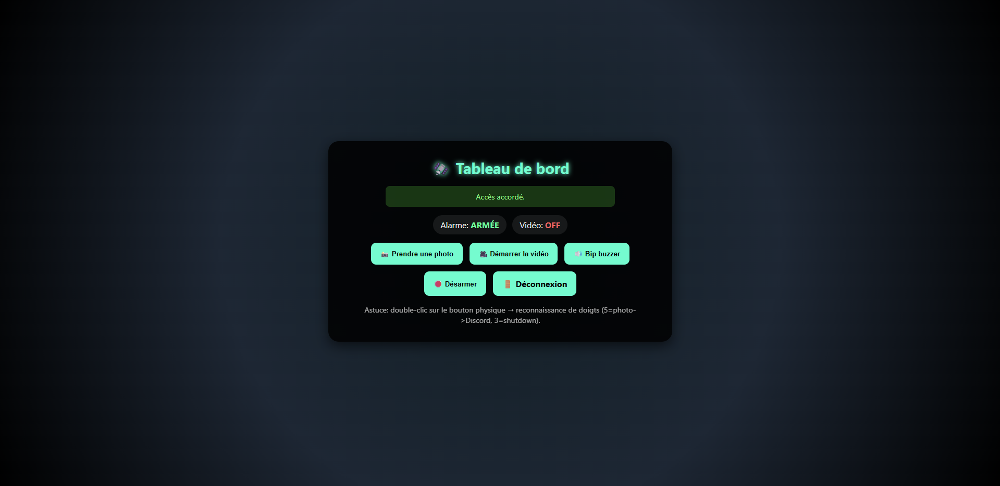
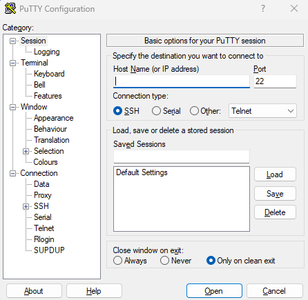

# WORKSHOP 2025 – EPSI/WIS

## Sujet : Q-LAB NOUVELLE GÉNÉRATION
📅 Du 15/09/2025 au 19/09/2025

## Équipe

- **DESFORGES Alexandre** – Hardware –  
- **DEVEER Evan** – Software – 
- **MARANT Yohann** – Software – 
- **KURAS Maxime** – Web Developer –
- **DUMONT Arthur** – Mixte Software&Hardware –  

---

## I) Présentation du projet

### a) Contexte
Le projet s'inscrit dans l'héritage du Q-Lab, inspiré des missions du MI6.  
Notre équipe a conçu un **parapluie espion**, nommé **BondBrella**, intégrant plusieurs fonctionnalités :  
- Une caméra dissimulée pouvant être activée via un bouton pour prendre des photos ou enregistrer des vidéos  
- Un système de détection des mains via **Mediapipe** pour analyser combien de doigts sont levés et déclencher des actions spécifiques  
- Un détecteur de mouvement qui envoie automatiquement une alerte sur un canal Discord privé lorsqu’il est manipulé  
- Un buzzer sonore servant de système d’alerte  

### b) Missions
- Créer un gadget espion fonctionnel et discret  
- Respecter les contraintes techniques (capteurs/actionneurs, communication secrète, sécurité, versionning Git)  
- Élaborer un scénario d’usage : comment le gadget sauve James Bond ?  

### c) Stratégie & Organisation 
- **Outils organisationnels** : Trello, GitHub 
- **Répartition des rôles** :  
  - Arthur Dumont → Web Developer 
  - Yohann Marant → Hardware (Raspberry Pi, montage électronique)  
  - Evan Dever → Software (Mediapipe, gestion venv)  
  - Alexandre Desforges → Hardware (câblage, schémas électroniques)  
  - Maxime Kuras → Mixte Software&Hardware (design, communication, intégration soft/hardware)  
- **Workflow** : planification de la semaine (idéation → prototypage → intégration → tests → démonstration)  

---

## II) Conception du gadget

### a) Idée générale
Le **BondBrella** est un parapluie multifonctions : gadget espion qui permet de capturer des images/vidéos, détecter des gestes ou mouvements, et alerter via un canal secret.  
Il illustre parfaitement l’esprit du Q-Lab en modernisant l’image des gadgets espions de James Bond.  

### b) Matériel utilisé
- **Microcontrôleur** : Raspberry Pi 3  
- **Capteurs** : détecteur de mouvement PIR, caméra  
- **Actionneurs** : buzzer sonore  
- **Interface** : bouton de commande  
- **Outils logiciels** : Python, Mediapipe, webhook Discord, PuTTY, FileZilla  

### c) Architecture & Schéma
- **Schéma électronique** : réalisé via Mammouth.ai  
- **Architecture logicielle** : Raspberry Pi (Python) → détection (Mediapipe, PIR) → webhook → alerte sur Discord  

---

## III) Structure logicielle

### a) Arborescence des fichiers

app
code.txt
├── app.py
├── mediapipe
│   └──Librairie
├── templates
│   ├── landing.html
│   ├── verify.html
│   └── dashboard.html
├── media
│   ├── photo
│   └── video
└── finger.py

### b) Fonctionnalités principales
- **Capture photo/vidéo** → via bouton (simple pression ou maintien)  
- **Détection de gestes (Mediapipe)** → reconnaissance des doigts levés et actions déclenchées  
- **Détection de mouvement PIR** → envoi d’une alerte via webhook Discord  
- **Alerte sonore** → buzzer activé selon certaines conditions  

---

## IV) Fonctionnalités du gadget

### A) Fonction espionne principale
- Caméra dissimulée pour photo et vidéo  
- Analyse des gestes de la main pour interactions discrètes  

### B) Méthode de communication/alerte
- Utilisation d’un **webhook Discord** avec la librairie `requests`  
- Notifications automatiques envoyées dans un salon privé  

### C) Sécurité minimale
- Accès distant sécurisé via SSH (PuTTY)  
- Gestion des fichiers via SFTP (FileZilla)  
- Utilisation d’un environnement virtuel (venv) pour isoler Mediapipe et éviter des conflits système  

### D) Scénario d’usage
 Exemple : “James Bond est en infiltration. Le BondBrella lui permet de prendre discrètement des photos, d’envoyer des alertes codées via Discord et d’activer un signal sonore pour détourner l’attention de ses ennemis.”  

---

## V) Démonstration

- 📑 Captures d’écran ou photo du prototype :

 

- 📑 Captures d’écran et photos du site :

- 📑 Captures d’écran et photos de l'interface putty de connexion au raspberry :

---

## VI) Outils & sources

### a) Outils utilisés
- **Gestion** : Trello, GitHub  
- **Conception** : Mammouth.ai 
- **Développement** : Python, Mediapipe  
- **Présentation** : Canva  

### b) Sources
- [Raspberry Pi Docs](https://www.raspberrypi.com/documentation/)  
- [ChatGPT](https://chatgpt.com)  
- [Mammouth.ai](https://mammouth.ai)  
- [Mediapipe](https://developers.google.com/mediapipe)  

---

## VII) Améliorations possibles
- **Axe 1** : amélioration technique (optimiser la détection des gestes avec Mediapipe)  
- **Axe 2** : nouvelles fonctionnalités (ajout d’une application mobile de contrôle à distance)  
- **Axe 3** : ergonomie / design (parapluie plus discret et design raffiné)
- **Axe 4** : Passer sur une génération 4 de Raspberry pour + de puissance de calculs et de traitement
